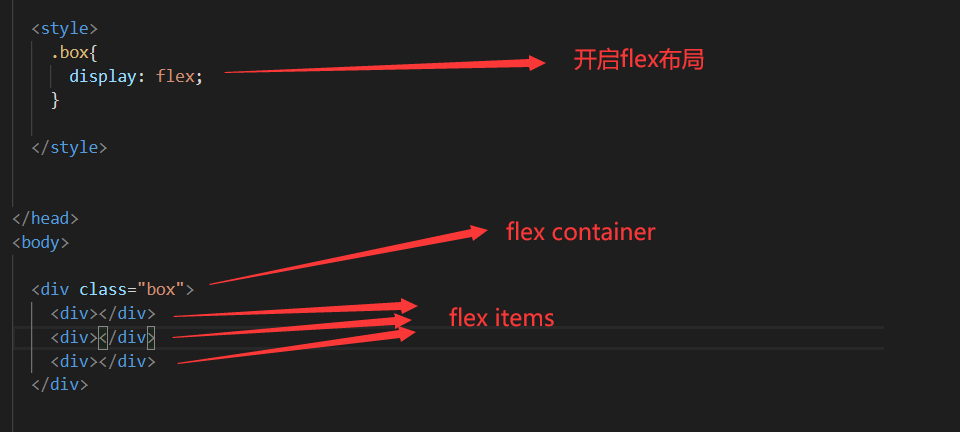
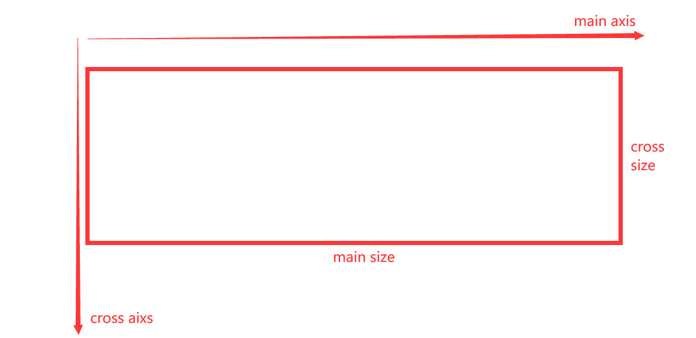
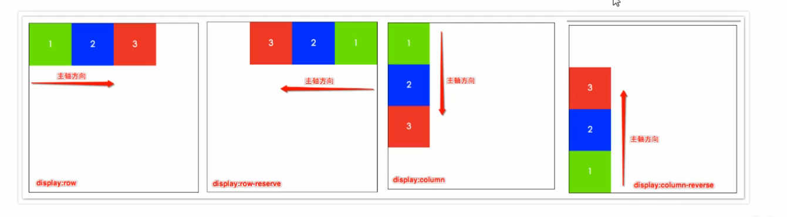
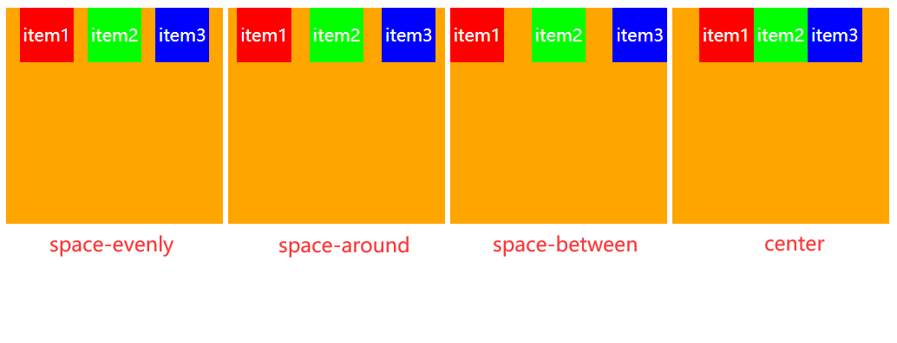
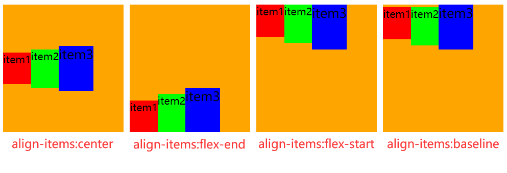

# 2021.2.4 WeSharp讲座

### 一、盒子模型

#### 1、盒子模型的组成

- 外边距margin：盒子与盒子之间的间距

- 边框border：盒子的边框

- 内边距padding：盒子内容与盒子边框之间的间距

- 内容content

  

#### 2、盒子模型中的水平居中

- `margin: 0 auto`即可实现水平居中。

### 二、float浮动

#### 1、块级元素以及行内元素

​		标签基本分为两种，一种是行内元素，另外一种是块级元素。

​	**行内元素和块级元素的区别：**

​		行内元素：(a,span)

- 与其他行内元素并排

- 不能设置宽高！！！

  块级元素：（div,p）

- 霸占一行，不接受和其他元素并列

- 能够设置宽高，默认宽度为父级元素的100%

#### 2、标准流

​		指的是元素排版布局过程中，元素会默认从左往右、从上往下的流式排列方式。前面的内容发生变化后，后面的内容位置也会随着发生变化。

#### 3、浮动

##### 3.1 什么是浮动？

​		通俗易懂地理解就是让原本霸道的块级元素在一行内显示。

##### 3.2 浮动的重要特性

- 浮动的元素会脱离标准流！！

- 浮动的盒子不再保留原来的位置！！
- 如果多个盒子都设置了浮动，则它们会按照属性值一行内显示并且顶端对齐排列

### 三、定位

#### 0、静态定位（了解）

position：static

- 静态定位按照标准流特性摆放
- 默认定位，很少用到

#### 1、相对定位

position：relative

- 元素在移动位置的时候，是相对它原来的位置进行定位。
- 相对定位的盒子不脱离标准流，标准流中的位置依然保留。

#### 2、绝对定位

position：absolute

- 元素在移动的时候，是相对于它的有相对定位的祖先元素来进行参考定位的。
- 如果没有祖先元素，就以浏览器的整个窗口作为参考进行定位。

#### 3、固定定位

position：fixed

- 脱标
- 位置固定

#### 4、粘滞定位

position：sticky

- 脱标
- 位置到一定位置粘滞

### 四、flex布局

#### 1、认识flex布局

- flex-container：开启flex布局的元素
- flex-item：flex container里面的直接子元素叫做flex-item

#### 2、开启flex布局

- display: flex

  flex-container以块级元素存在

- display: inline-flex

  flex-container以行内元素存在

#### 3、flex布局模型

- main axis 主轴
- cross axis 交叉轴

#### 4、flex中的相关属性

##### 4.1、flex-container的属性

- flex-glow

- **flex-direction**

  flex-items默认都是沿着main axis（主轴）从main start开始往main end方向排布

  flex-direction决定了main axis的方向，有4个取值

  - row（default）

  - row-reverse（主轴从右置左）

  - column（主轴从上到下）

  - column-reverse（主轴从下到上）

    

- flex-wrap

- **justify-content**

  justify-content决定了flex-items在main axis上的对齐方式，有以下取值

  - flex-start（default）：与main start对齐

  - flex-end：与main end对齐

  - center：居中对齐

  - space-between：flex-items之间的间距相等，两边与main start、main end对齐

  - space-evenly：flex-items之间的间距相等，两边的距离和flex-items之间的间距相同

  - space-around：flex-items之间的间距相等，两边的距离是lex-items之间的间距的一半

    

- **align-items**

  align-items决定了在cross axis上的对齐方式，有以下取值

  - normal（default）：和stretch效果相同
  - stretch：当flex-items在cross axis方向的size为autu时，会自动拉伸直至填满flex-container
  - flex-start：与cross start对齐
  - flex-end：与cross end对齐
  - center：居中对齐
  - baseline：与基准线对齐（item内容的底部对齐）

  

- align-content

##### 4.2、flex-item的属性

### 五、临摹小米官网